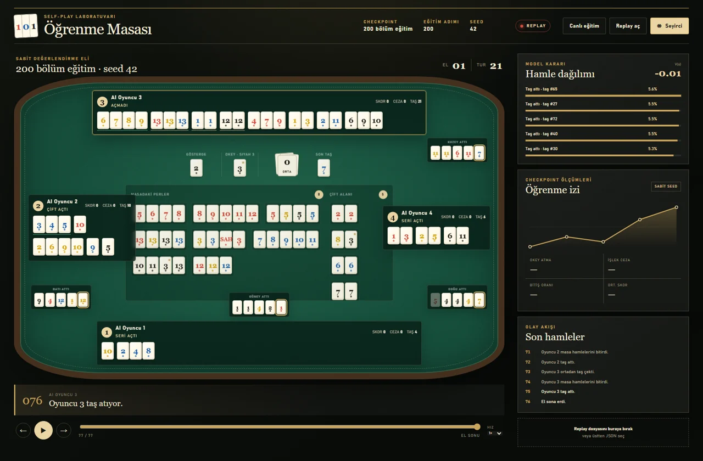
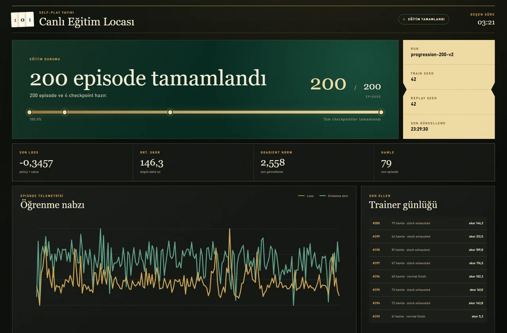
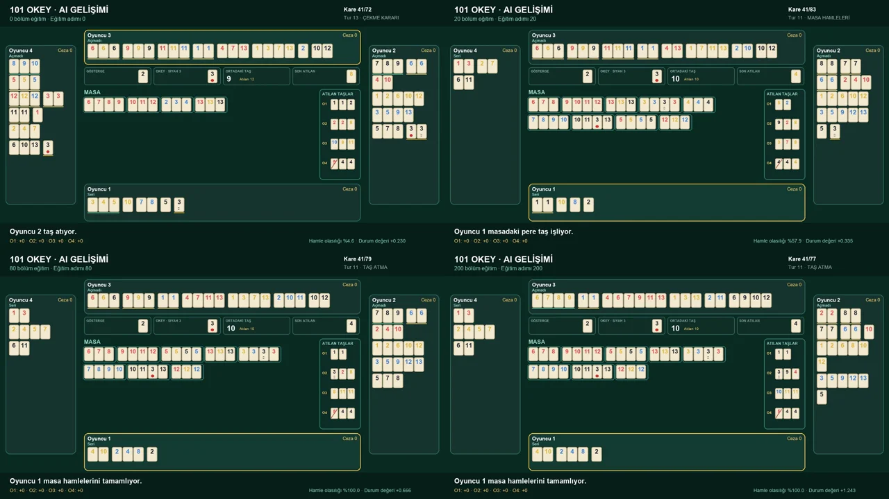
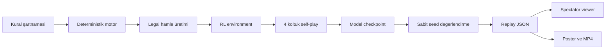

# 101 Okey Self-Play AI

Deterministik bir 101 Okey motoru üzerinde dört yapay zekânın aynı politikayı
kullanarak kendi kendine oynadığı; eğitimin canlı izlenebildiği ve her
checkpoint'in replay/video olarak karşılaştırılabildiği araştırma projesi.

<p align="center">
  
</p>

## Proje ne yapıyor?

Bu depo üç katmanı bir araya getirir:

1. **101 Okey motoru:** Taşlar, Okey/sahte Okey, seri ve çiftler, açılış,
   masaya işleme, cezalar, bitiş ve puanlama deterministik olarak uygulanır.
2. **Self-play eğitimi:** Dört koltuk aynı öğrenen politikayı paylaşır ve
   yalnızca motorun verdiği legal hamleler arasından seçim yapar.
3. **Görsel izleme:** Eğitim telemetrisi canlı panelde izlenir; sabit seed'li
   eller replay, poster ve MP4 olarak üretilir.

> [!IMPORTANT]
> Bu projede **1 episode = dört oyuncunun birlikte oynadığı 1 tam eldir**.
> Örneğin 200 episode, 200 ayrı 101 Okey eli anlamına gelir.

Model rakiplerin gizli ellerini görmez. Spectator ekranında bütün ellerin
gösterilmesi yalnızca replay/render katmanına aittir ve policy girdisine
eklenmez.

## Şu anda neler hazır?

- 106 fiziksel taşı koruyan ve seed ile yeniden üretilebilen oyun motoru
- Seri, aynı sayı peri, çift ve explicit Okey assignment solver'ları
- Normal/katlamalı açılış, yandan taş alma, masaya işleme ve Okey geri alma
- İşlek taş ve Okey atma cezaları, final-discard ve ayrıntılı bitiş nedenleri
- Tek el RL environment'ı ve ID içermeyen observation/action encoding
- Dört koltuk tarafından paylaşılan NumPy actor-critic self-play modeli
- `.npz` checkpoint kaydetme ve aynı noktadan deterministik devam etme
- Canlı loss, skor, hamle ve checkpoint takibi
- Doğrulanabilir replay JSON'u, spectator viewer ve H.264 MP4 üretimi
- 0 / 20 / 80 / 200 gibi checkpoint'leri aynı sabit elde karşılaştırma

<p align="center">
  
</p>

## Gereksinimler

- Python **3.11 veya üzeri**
- Eğitim için NumPy
- Testler için pytest
- Poster/replay kareleri için Pillow
- MP4 üretmek için sistem `PATH`'inde FFmpeg

FFmpeg yalnızca video üretirken gerekir. Motoru, testleri ve videosuz eğitimi
FFmpeg olmadan çalıştırabilirsiniz.

## Hızlı başlangıç

Depoyu indirdikten sonra proje kökünde:

```powershell
py -3.11 -m venv .venv
.\.venv\Scripts\Activate.ps1
python -m pip install --upgrade pip
python -m pip install -e ".[dev,video]"
python -m pytest
```

FFmpeg kurulumunu kontrol etmek için:

```powershell
ffmpeg -version
```

## 200 eli canlı izleyerek eğitme

Aşağıdaki tek komut:

- 200 self-play eli oynatır,
- 0, 20, 80 ve 200. episode'larda checkpoint alır,
- her checkpoint'i 20 sabit değerlendirme elinde ölçer,
- seed 42 ile doğrulanmış replay ve MP4 üretir,
- canlı eğitim panelini tarayıcıda açar.

```powershell
python -m benchmarks.train_progression `
  --episodes 200 `
  --checkpoints 0,20,80,200 `
  --seed 42 `
  --replay-seed 42 `
  --evaluation-episodes 20 `
  --output-dir artifacts\training\progression-200 `
  --serve-port 4173 `
  --open-dashboard `
  --keep-serving
```

Eğitim bitince panel açık kalır. Kapatmak için terminalde `Ctrl+C` kullanın.

> [!NOTE]
> `--output-dir` var olan ve dolu bir klasörün üzerine yazmaz. Yeni deney için
> `progression-200-v2` gibi yeni bir klasör adı seçin.

Videosuz ve daha hızlı bir deneme için komuta `--no-video` ekleyebilirsiniz.

Canlı panel artık şunları ayrı ayrı raporlar:

- saf eğitim hızı, hamle hızı ve tahmini kalan süre,
- toplam ve oyuncu bazında işlek taş/Okey atma cezaları,
- ceza olayı ile gerçek ceza puanı,
- seri/çift açma, bitirme ve terminal nedenleri,
- checkpoint başına sabit-seed skor, ödül, ceza ve davranış oranları.

Panel için örneklenmiş geçmiş `status.json` içinde, her episode'un tam kaydı ise
aynı deney klasöründeki `history.jsonl` dosyasında tutulur.

## 10.000 episode uzun koşu

```powershell
python -m benchmarks.train_progression `
  --episodes 10000 `
  --checkpoints 0,100,1000,2000,5000,10000 `
  --seed 42 `
  --replay-seed 42 `
  --evaluation-episodes 100 `
  --output-dir artifacts\training\progression-10000 `
  --serve-port 4173 `
  --open-dashboard `
  --keep-serving
```

Her checkpoint için model, sabit değerlendirme, doğrulanmış replay, poster ve
MP4 üretilir. Nihai eğitilmiş model:

```text
artifacts\training\progression-10000\checkpoints\checkpoint-10000.npz
```

Bu `.npz` yalnız ağırlıkları değil; optimizer adımını, optimizer durumunu,
tamamlanan episode/hamle sayılarını ve RNG durumunu da taşır. Daha sonra replay
üretmekte kullanılabilir veya `python -m okey101.training.cli --resume ...`
ile deterministik biçimde eğitime devam edilebilir.

## Replay izleme

Bir replay dosyasını bağımsız viewer'da açmak için proje kökünde:

```powershell
python -m http.server 4173
```

Ardından tarayıcıdan:

```text
http://127.0.0.1:4173/viewer/
```

adresini açın ve üretilen JSON dosyasını **Replay aç** düğmesiyle seçin.

Viewer şunları gösterir:

- dört oyuncunun görsel olarak gruplanmış ıstakaları,
- gösterge, gerçek Okey, stok ve son atılan taş,
- her oyuncunun atış geçmişi,
- masadaki per ve çiftler,
- seçilen hamle ve alternatif politika olasılıkları,
- skor, ceza, tur ve terminal nedeni.

Tam eller spectator modunda görünür. **Seyirci** düğmesi kapatıldığında yalnızca
sırası gelen oyuncunun eli açık kalır.

## Checkpoint videosu üretme

Önce kısa bir model checkpoint'i:

```powershell
python -m okey101.training.cli `
  --episodes 40 `
  --seed 0 `
  --checkpoint artifacts\training\checkpoint-40.npz `
  --evaluate 20
```

Ardından sabit seed'li replay:

```powershell
python -m benchmarks.replay `
  --model-checkpoint artifacts\training\checkpoint-40.npz `
  --seeds 42 `
  --output-dir artifacts\replays\checkpoint-40 `
  --top-candidates 5
```

Son olarak H.264 video:

```powershell
python -m benchmarks.render_replay `
  artifacts\replays\checkpoint-40\checkpoint-40-seed-42.json `
  --output artifacts\replays\checkpoint-40\checkpoint-40-seed-42.mp4 `
  --fps 2
```

<p align="center">
  
</p>

Sabit replay seed'i sayesinde checkpoint'ler aynı başlangıç dağıtımıyla
karşılaştırılır. Politika farklı hamle seçtiğinde sonraki durumların ayrışması
normaldir.

## Çıktılar nereye yazılır?

Üretilen çalışma dosyaları Git'e eklenmez ve tek bir klasörde tutulur:

```text
artifacts/
├── training/        # checkpoint, status, replay, poster ve MP4
├── replays/         # bağımsız replay/video çıktıları
├── stress/          # uzun stres koşuları
├── stress-failures/ # yeniden oynatılabilir hata kayıtları
└── viewer/          # tarayıcı test ekran görüntüleri ve loglar
```

## Nasıl çalışıyor?



Motor strateji öğretmez; yalnızca kuralları ve legal hamleleri garanti eder.
Model, örneğin hangi taşı tutacağına veya ne zaman açacağına kendisi karar
verir. Fiziksel raftaki taş sırası model girdisi değildir.

## Proje yapısı

```text
.
├── benchmarks/  # benchmark, replay, stress ve progression komutları
├── docs/        # kurallar, mimari, planlar ve güncel durum
├── src/okey101/
│   ├── agents/
│   ├── engine/
│   ├── replay/
│   ├── rl/
│   ├── solver/
│   ├── training/
│   └── visualization/
├── tests/       # unit, integration, differential ve replay testleri
├── viewer/      # dependency-free replay ve canlı eğitim arayüzü
├── README.md
└── pyproject.toml
```

## Doğrulama

Güncel kalite kapıları:

- **198** unit/integration/differential test
- 100.000 el invariant stres testi
- 106 taş için fiziksel ID conservation kontrolleri
- hidden-information leakage testleri
- replay SHA-256 ve deterministik engine replay doğrulaması
- masaüstü ve taşma kontrolü amaçlı tarayıcı smoke testleri
- 1280×720, H.264, YUV420p video doğrulaması

Temel geliştirme kontrolleri:

```powershell
python -m pytest
python -m compileall -q src benchmarks tests
python -m benchmarks.engine --rounds 100 --seed 0 --json
python -m benchmarks.solver --seeds 100 --measure-memory
python -m benchmarks.stress --rounds 1000 --workers 8
```

## Projenin mevcut sınırı

Bu, kuralları doğrulanmış çalışan bir araştırma/öğrenme altyapısıdır; mevcut
200 episode sonucu “güçlü veya insan seviyesinde 101 Okey oyuncusu” kanıtı
değildir. Şu anki learner küçük bir NumPy actor-critic modelidir.

Sıradaki teknik hedefler:

1. daha uzun sabit-seed deneyleri ve güven aralıkları,
2. geçmiş checkpoint'lerden rakip havuzu ve terfi kapısı,
3. büyük legal-candidate durumları için hiyerarşik/streaming scorer,
4. batched inference ve multiprocessing self-play worker'ları.

## Teknik belgeler

İç belgelerin başlangıç noktası: [`docs/README.md`](docs/README.md)

- [Proje hedefleri ve kapsam](docs/01_GOALS_AND_SCOPE.md)
- [Authoritative 101 Okey kuralları](docs/02_RULES_SPEC.md)
- [Engine mimarisi](docs/03_ENGINE_ARCHITECTURE.md)
- [Action ve observation tasarımı](docs/04_ACTION_AND_STATE_DESIGN.md)
- [Test ve doğrulama planı](docs/05_TEST_AND_VALIDATION_PLAN.md)
- [Self-play AI planı](docs/06_SELF_PLAY_AI_PLAN.md)
- [Kilitli kararlar ve açık maddeler](docs/09_LOCKED_DECISIONS_AND_OPEN_ITEMS.md)
- [Güncel implementation durumu](docs/11_ENGINE_IMPLEMENTATION_STATUS.md)
